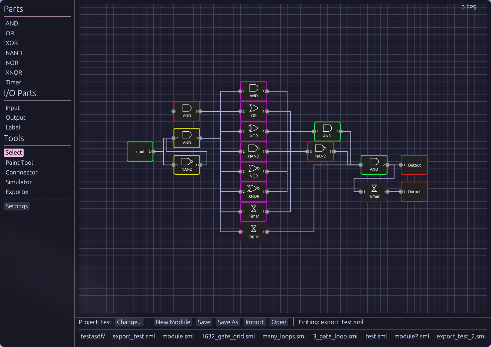

# SMLogic
A simple tool for designing complex Scrap Mechanic logic circuits :) \
if you find this tool useful, have issues/recommendations or have anything else to say, feel free to reach out! (preferably discord)

### images

## Some info
if you want to generate modules that are very complex or annoying to make, [here](./python_library/info.md) is the information for the python library for generating modules

you save and load modules with the bottom bar, you are also able to import modules as their own part by clicking on them once with input and output parts inside it correlating to the parts IO.

the connector tool is meant to help when you need to connect many things at once, it currently doesn't have many modes but im working on adding more, if you have ideas lmk!

As for the simulator, it runs in a seperate thread for better performance. It runs very efficiently (took ages to make lol) and lets you manually limit the tps (default 40) as well as step one tick at a time, you are able to click on parts to toggle them on or off for debugging circuits.

when it comes to exporting, it should find your scrap mechanic blueprints folder for you, if not check in settings. there are many options for exporting, however most aren't important and no matter what options you pick the overall function will stay the same, it just changes the positions of the gates. if you turn on "Keep IO Position" it will try and position all inputs, outputs, and "important" parts as they are in the canvas, which is useful for displays (or anything else really).

### NOT VIBE CODED!
I made this project to learn rust better as I am very new to it, the project ended up being more complex than I'd imagined however I only used ai for debugging, and helping answer questions I had. any functions that were AI generated I marked as so in the source code.
