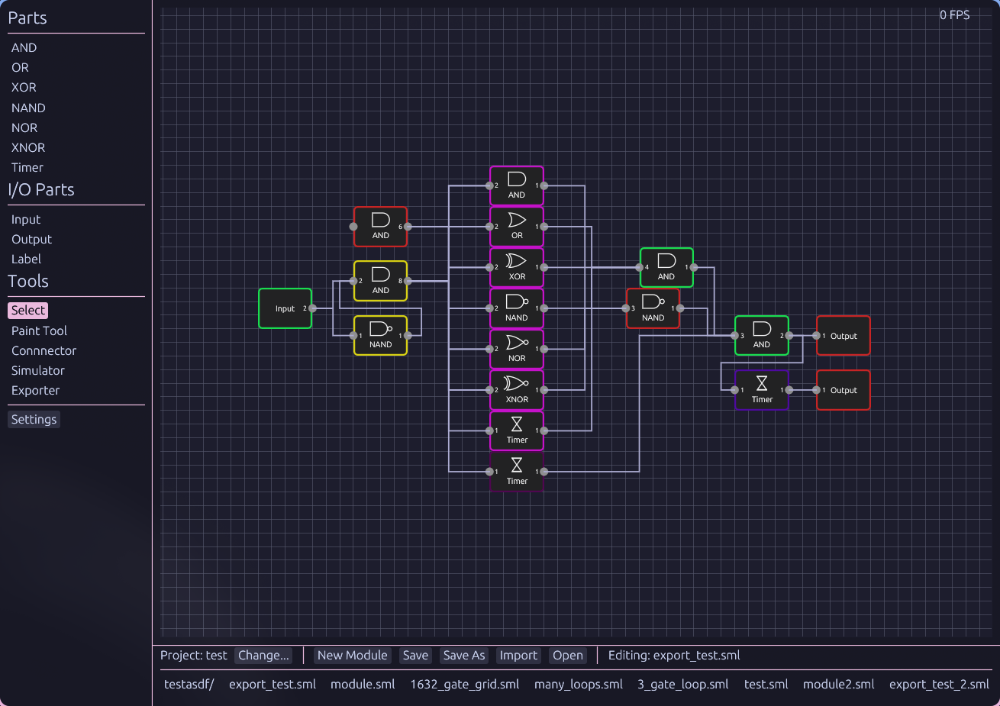

# SMLogic
A simple tool for designing complex Scrap Mechanic logic circuits :) \
if you find this tool useful, have issues/recommendations or have anything else to say, feel free to reach out! (preferably discord)

### images

## Some info
you save and load modules with the bottom bar, you are also able to import modules as their own part by clicking on them once with input and output parts inside it correlating to the parts IO.

when it comes to exporting, it should find your scrap mechanic blueprints folder for you, if not check in settings. there are many options for exporting, however most aren't important and no matter what options you pick the overall function will stay the same, it just changes the positions of the gates.

### NOT VIBE CODED!
I made this project to learn rust better as I am very new to it, the project ended up being more complex than I'd imagined however I only used ai for debugging, and helping answer questions I had. any functions that were AI generated I marked as so in the source code.
